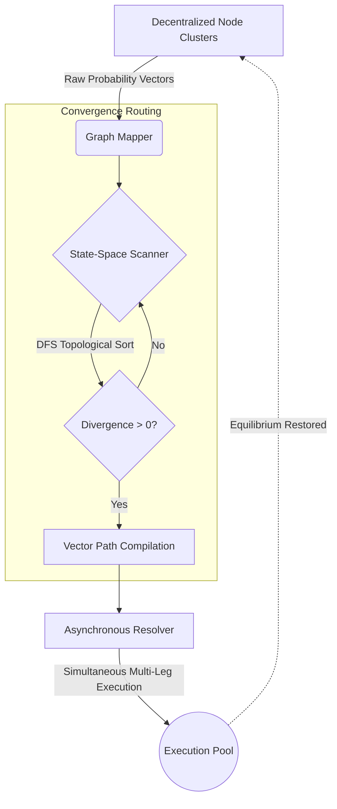

<div align="center">
  <h1>Topological Convergence Router</h1>
  <p><b>State-Space Graph Scanner & Distributed Execution Engine</b></p>
  
  [](https://github.com/mahimalam/topological-convergence-router/actions/workflows/ci.yml)
  [](https://python.org)
  [](#)
  [](#)
  [](https://opensource.org/licenses/MIT)

  <p><i>An advanced routing daemon that maps highly complex, multi-variable probability graphs to autonomously resolve mathematically divergent network states.</i></p>
</div>

<br/>

## ⚡ Executive Summary

The **Topological Convergence Router (E1)** is a specialized mathematical engine designed to identify multi-node structural divergences within a decentralized state network. While simple systems look for linear discrepancies between Point A and Point B, this engine maps complex relational graphs (e.g., mutually exclusive state sets) to discover deep-layer topological inconsistencies.

When a topological impossibility is detected (where the sum of mutually exclusive probabilities exceeds 1.0 due to network latency), the Router compiles a multi-leg resolution vector to force the network back into mathematical equilibrium.

---

## 🏗️ System Architecture

The architecture utilizes a parallelized Depth-First Search (DFS) state-space scanner. 



---

## 🧩 Core Modules

### 1. The Graph Scanner (`/core_logic`)
The heart of the system is a continuous evaluation loop that parses decentralized networks into directed graphs.
- **`multi_node_scanner.py`**: Executes a high-speed traversal over linked node subsets. It identifies mutually exclusive terminal states and calculates their aggregate probability vectors.
- **`late_state_scanner.py`**: A specialized sub-routine designed to evaluate graphs that are nearing their final terminal states, where velocity and volatility are highest.

### 2. The Vector Compiler (`/models`)
- **`convergence_opportunity.py`**: A highly optimized `dataclass` structure that encapsulates the mathematical proof of a topological divergence. It defines the exact multi-leg path required to resolve the inconsistency, prioritizing operations based on computational efficiency and capital requirements.

### 3. The Asynchronous Resolver (`/execution`)
- **`resolver.py`**: Deploys the calculated resolution vectors to the external network using `asyncio` primitives. It ensures that all legs of a topological resolution are executed as closely to simultaneously as physically possible, minimizing exposure to partial state shifts.

---

## ⚙️ Technical Specifications

- **Language:** Python 3.10+
- **Algorithmic Complexity:** The graph traversal algorithms are strictly bounded to $O(V + E)$ where $V$ represents terminal states and $E$ represents correlative links.
- **Execution Speed:** Vector compilation occurs in $<5ms$ upon receiving asynchronous state updates.
- **Network Interface:** Non-blocking async clients designed to saturate available I/O throughput.

---

## 🚀 Deployment Requirements

The Router is designed to operate as an independent microservice within a broader orchestration mesh.

```bash
# Clone the repository
git clone https://github.com/mahimalam/topological-convergence-router.git

# Install dependencies
pip install -r requirements.txt

# Start the topological scanner daemon
python main.py --mode multi_node --log-level INFO
```

